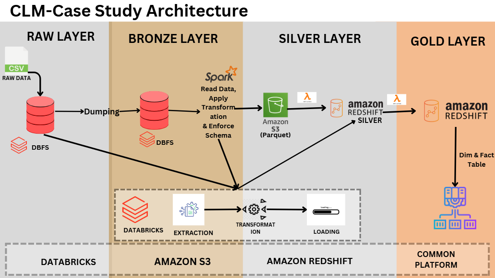
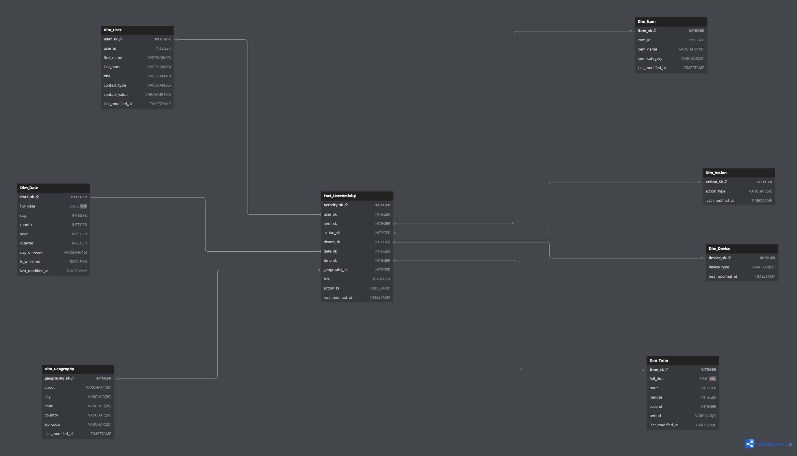

# Case Study Documentation

## 1. Introduction

### Problem Statement

The objective of this case study is to create a robust data pipeline following best data engineering practices to process and structure user activity data for analytical purposes. The data pipeline must transform raw data into a serving layer using the Medallion Architecture (Bronze, Silver, Gold layers) to enable business intelligence and decision-making.

### Business Use Case

The data will be utilized to analyze customer behavior, segment customers into different lifecycle stages, and calculate liquidity, helping businesses understand their user interactions and optimize their strategies accordingly.

### 2. Data Overview

Structure of Sample Data

The dataset consists of user activity records with the following attributes:

| Name           | Type     | Description |
|---------------|---------|-------------|
| user_id       | INT     | Unique identifier for the user |
| user_name     | JSON    | Contains FirstName, LastName, and Title |
| user_address  | JSON    | Contains Street, City, State, Country, Zip Code |
| user_contact  | JSON    | Contact type and value |
| action_type   | ENUM    | Type of action (Post or Replied) |
| action_ts     | TIMESTAMP | Timestamp of the activity |
| item_id       | INT     | Unique identifier for the item |
| item_name     | STRING  | Name of the item |
| item_category | STRING  | Category of the item |
| device        | ENUM    | Device used for performing an action |
| b2c           | BOOL    | Flag indicating business-to-customer transaction |

### 3. Architecture

The architecture follows the Medallion approach:

1. Bronze Layer (Raw Data Storage)

 - Raw files are stored in DBFS (Databricks File System).

 - Files are then moved to a structured Bronze Layer in DBFS.

2. Silver Layer (Cleaned & Transformed Data)

 - Data from the Bronze Layer is cleaned, transformed, and stored in S3 (Amazon Simple Storage Service).

 - When a new Parquet file is uploaded to S3, an S3 Event Notification triggers a Lambda Function.

3. Gold Layer (Serving Layer for Analysis)

 - The Lambda function processes and loads the cleaned data into Amazon Redshift (Silver Layer).

 - Data is then further transformed and populated into dimension and fact tables in Redshift Gold Layer.

 - SCD Type 2 (Slowly Changing Dimensions) is used to handle upserts for user activity data.

#### Technology Stack

 - Data Processing: Databricks (DBFS, PySpark)

 - Storage: S3 (Silver Layer)

 - Computation & Automation: AWS Lambda, AWS Step Functions

 - Data Warehouse: Amazon Redshift

 - Transformation: SQL, Redshift Stored Procedures

 - Notification & Orchestration: S3 Events, Lambda Triggers

 ### 4. Data Processing Workflow

#### Step 1: Ingestion (Bronze Layer)

- Raw data files are initially stored in DBFS.

- Data is then copied into a structured Bronze Layer in DBFS.

#### Step 2: Transformation (Silver Layer)

- Data is cleaned and transformed using PySpark.

- The cleaned data is saved in Parquet format and stored in S3.

- When a new file is added to S3, it triggers an AWS Lambda function.

#### Step 3: Loading into Redshift (Silver Layer in Redshift)

- Lambda function loads data from S3 into Redshift Silver Layer.

- Data consistency is ensured by handling incremental and full loads.

#### Step 4: Populating Gold Layer (Fact & Dimension Tables in Redshift)

- Data from the Silver Layer is transformed and stored into:    
- Dimension Tables: dim_user, dim_item, dim_device, etc.

- Fact Tables: fact_user_activity

- Upsert operations are handled using SCD Type 2 to track historical changes.

### 5. Challenges & Solutions

#### Challenge 1: Automating Data Movement from DBFS to S3

- Problem: Ensuring all new files are moved efficiently without duplicates.

- Solution: Implemented logic to check existing files before moving new ones to S3.

#### Challenge 2: Handling Incremental vs Full Loads

- Problem: Avoiding redundant data insertion while ensuring updates are captured.

- Solution: Used last_modified_at timestamps to determine if data should be updated or inserted.

#### Challenge 3: SCD Type 2 Implementation in Redshift

- Problem: Maintaining historical changes without losing previous records.

- Solution: Used Redshift MERGE queries to insert new records and update existing ones while preserving history.

#### Challenge 4: Lambda Function Execution Time

- Problem: Ensuring Lambda function doesn’t time out while processing large data files.

- Solution: Optimized the function by batch processing and using Step Functions for orchestration.

#### Challenge 5: Redshift Performance Optimization

- Problem: Query performance issues due to large data volumes.

- Solution: Implemented appropriate distribution keys, sort keys, and column encodings for performance tuning.

### 6. Conclusion

This case study demonstrates a fully automated and scalable data pipeline using the Medallion architecture. By leveraging Databricks, S3, AWS Lambda, and Amazon Redshift, the pipeline ensures efficient data transformation and storage. Implementing incremental updates, SCD Type 2, and optimized Redshift design allows for accurate and up-to-date business analytics, enabling stakeholders to make data-driven decisions efficiently.
